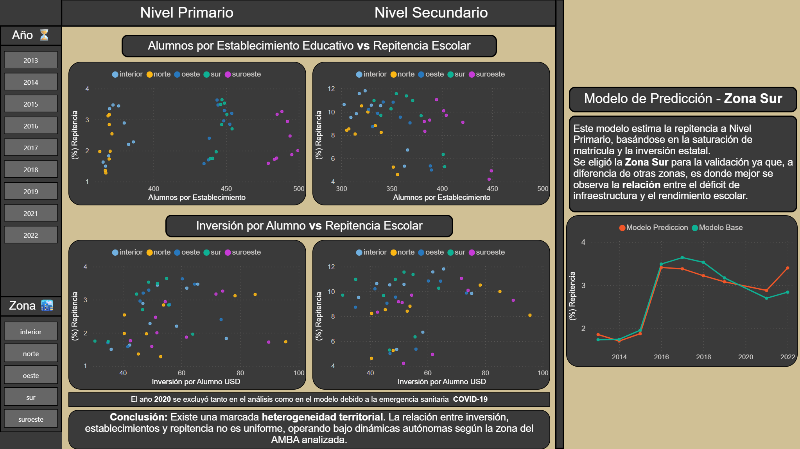

# 📊 Análisis de Inversión y Rendimiento Educativo - AMBA (2012-2022)

Este proyecto integra datos de múltiples fuentes (Inversión, Población, Educación,Establecimientos Educativos) para analilizar la repitencia escolar, en donde vamos a buscar variables independientes que expliquen la repitencia y con dichas variables crear un modelo para predecir la repitencia escolar en los proximos años.

##  Resultado Final: Business Intelligencea
 

##  Flujo de Trabajo

### 1. Extracción y Limpieza Profunda
* **Desafío:** Los archivos originales presentaban IDs de municipios inconsistentes entre sí.
* **Solución:** Realicé un proceso de **Data Wrangling** manual para normalizar los identificadores de 40 municipios, asegurando la integridad referencial para los cruces de datos.

### 2. Modelado de Datos en SQL
Transformé los datos crudos en un **Esquema en Estrella (Star Schema)** mediante scripts estructurados:
* **Capas de datos:** Implementé una arquitectura de `Staging` -> `Fact Tables` -> `Reporting Views`.
* **Lógica Financiera:** Integré la cotización histórica del dólar para calcular la **Inversión Real en USD**, eliminando el sesgo de la inflación local.

### 3. Visualización y Analytics
* **Power BI:** Diseño de un tablero interactivo con KPIs de tasas de repitencia por zona.
* **Python:** Análisis exploratorio (EDA) utilizando `Seaborn` para validar tendencias.

## 📂 Estructura del Proyecto
* `/data`: Datasets originales y procesados.
* `/sql`: Modelado de tablas de hechos y dimensiones.
* `/notebooks`: Gráficos en Python y modelo de regresión.
* `/img`: Capturas del Dashboard final.

## 🛠️ Tecnologías
**SQL | Python (Pandas/Seaborn) | Power BI | Git**
